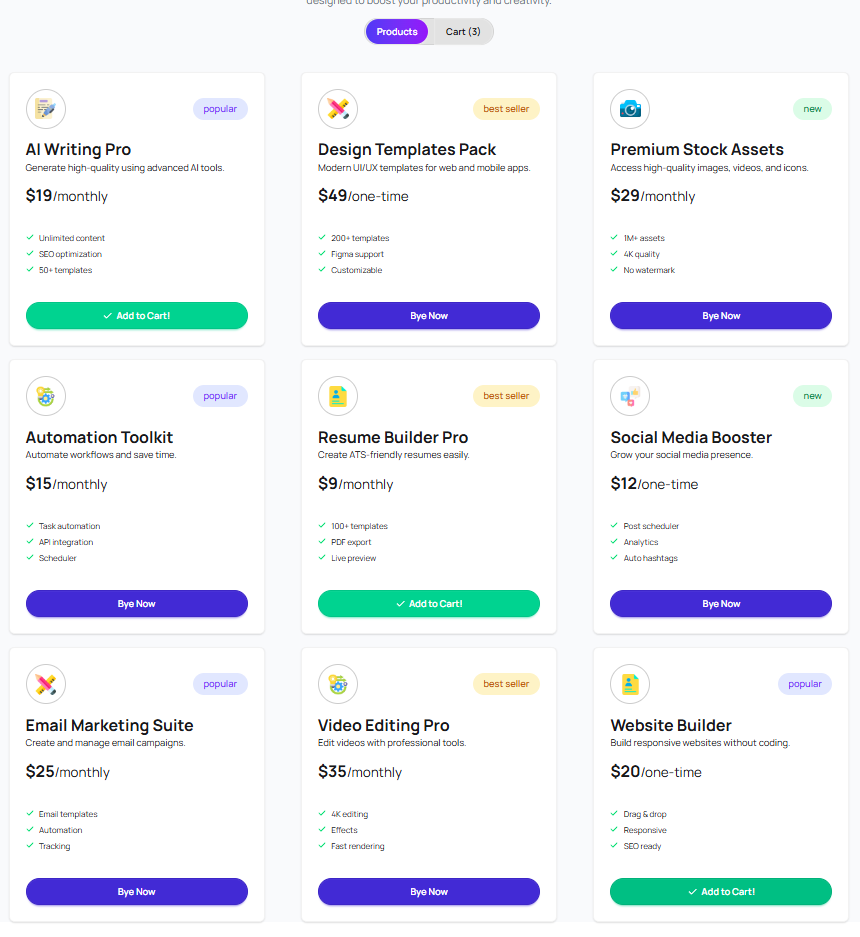

#  Project Name : Premium Digital Tools Bey

---

##  Description

This project is built to provide users with an intuitive interface where they can interact with different features seamlessly. It includes dynamic components, responsive design, and efficient data handling to ensure a great user experience.

---

## Technologies Used

- React.js
- Tailwind CSS
- JavaScript (ES6+)
- React Toastify
- React Icons
- HTML & CSS

---

##  Features

- Interactive UI with responsive design  
- Dynamic data rendering using components  
- Real-time notifications with toast alerts  

---

##  Preview

---
